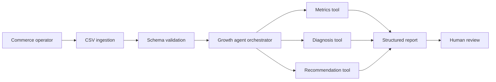

# E-commerce Growth Agent

[](https://github.com/magicyao2028-pixel/ecommerce-growth-agent/actions/workflows/ci.yml)
[](LICENSE)

> 中文介绍：这是一个面向中小电商企业的离线经营分析与决策辅助原型。它将销售、流量、广告和库存数据转化为经营指标、风险诊断和行动建议，完整展示需求分析、PRD、业务流程、系统架构、接口规范、测试、评测与迭代设计。公开版本仅使用合成数据，不包含任何公司或客户隐私。

**Live prototype:** https://magicyao2028-pixel.github.io/ecommerce-growth-agent/

## Project context

This portfolio edition documents an AI application and product practice explored in the business context of **Changsha Shiju Trading Co., Ltd.** It is designed to show how an operational problem can be converted into a testable product, rather than presenting a model-call demo as a finished commercial system.

## Business problem

Small e-commerce teams often review traffic, orders, advertising and inventory in separate spreadsheets. The process is slow, difficult to standardize and dependent on individual experience. This project provides one decision workspace that:

- calculates GMV, conversion, ROI and contribution profit;
- detects traffic, conversion, advertising and stock risks by SKU;
- prioritizes actions with explicit evidence;
- keeps a visible execution trace for review;
- keeps a bounded local history of safe analysis summaries without source rows;
- works offline and does not require a paid model API.
- provides a 10–20 minute reviewer trial with a machine-readable evidence chain and a feedback regression replay.
- can add an evidence-constrained explanation while keeping calculations deterministic and external actions human-owned.
- exposes a versioned offline service contract and an optional FastAPI adapter without making web dependencies mandatory.
- emits a deterministic retry receipt for the service boundary without persisting request payloads or claiming distributed deduplication.
- summarizes caller-supplied, already-redacted request latency and error fields for local review without a monitoring service or external write.

## What this repository demonstrates

| Capability | Evidence |
| --- | --- |
| Product discovery | [PRD](docs/PRD.md) and documented assumptions |
| Process design | [Business flow](docs/BUSINESS_FLOW.md) |
| Technical design | [Architecture](docs/ARCHITECTURE.md) and [OpenAPI specification](docs/openapi.yaml) |
| Agent workflow | Explicit tool selection, execution trace and recommendation prioritization |
| Product validation | Unit tests, evaluation cases and acceptance criteria |
| Reproducible evaluation | [Seven-case rule baseline](reports/evaluation_report.md) covering all six implemented findings |
| Data-minimized persistence | Local summary history with fingerprints, age limits and record limits |
| Security thinking | Offline-first design, synthetic data and human approval boundaries |
| User-facing prototype | Zero-cost static web application in [`site/`](site/) |
| Trial readiness | [Reviewer trial](docs/TRIAL_GUIDE.md), [evidence index](evidence/evidence_index.json), external-intake decision and synthetic feedback regression |
| Explanation safety | Structured adapter context, finding citations, unsupported-number checks and deterministic fallback |

## Architecture



The current MVP is deliberately deterministic and offline. This makes every recommendation traceable and keeps the project free to run. A future LLM adapter may explain structured findings, but it must not replace metric calculation or human approval.

## Quick start

Requirements: Python 3.10 or later. No third-party runtime dependency is required. The optional HTTP boundary uses the free `service` extra.

```bash
python -m pip install -e .
growth-agent data/sample_sales.csv --output report.json
growth-agent data/sample_sales.csv --config config/business_thresholds.json --output report.json
growth-agent data/sample_sales.csv --history output/analysis_history.json --history-retain-days 90 --history-max-records 20
growth-agent data/sample_sales.csv --explain --generated-at 2026-08-21T00:00:00+00:00 --output examples/sample_report_with_explanation.json
growth-agent-trial
python -m unittest discover -s tests -v
```

Optional HTTP boundary:

```bash
python -m pip install -e ".[service]"
uvicorn ecommerce_growth_agent.service:create_fastapi_app --factory --host 127.0.0.1 --port 8000
```

`GET /health` is a liveness check. `POST /v1/analyze` accepts `{ "rows": [...], "generated_at": "...", "include_explanation": true }` and returns the deterministic report plus a `request_receipt`. The receipt fingerprints validated rows, effective guardrails and explanation mode; it excludes `generated_at` so a retry can be compared. Authentication, shared persistence, distributed deduplication and external actions are deliberately not implemented.

To view the prototype locally, open `site/index.html` or serve the folder:

```bash
python -m http.server 8000 --directory site
```

Then visit `http://localhost:8000`.

## Input data

The CSV schema is intentionally simple:

```text
date,sku,product_name,category,impressions,clicks,orders,units,revenue,ad_spend,cost,stock
```

All monetary values are assumed to use the same currency. The sample file contains synthetic data.

## Output

The agent returns:

- portfolio-level KPI summary;
- SKU-level diagnostic findings;
- prioritized operational recommendations;
- a transparent execution trace;
- warnings when data or assumptions are incomplete.
- when `--explain` is requested, grounded explanation items with source evidence, owner, approval boundary and adapter/fallback metadata.

## Local analysis history

The optional `--history` file stores only portfolio summaries, finding codes, counts, the source filename, a SHA-256 data fingerprint and a hash of the effective guardrail context. Identical retries are skipped only when the source, data and guardrails match. It deliberately excludes source rows, customer identifiers, order details and free-text notes. The default policy retains at most 20 records for 90 days; both limits are explicit CLI options. This is single-user local persistence, not a shared database or an audit-compliant record system.

## Product boundaries

This is a product-validation MVP, not a production ERP or advertising platform. It does not automatically change prices, pause campaigns, place purchase orders or publish content. High-impact actions require human confirmation.

## Configurable business guardrails

The default review thresholds are visible in [`config/business_thresholds.json`](config/business_thresholds.json). Operators can supply a JSON file through `--config`; the report preserves the effective values so a reviewer can reproduce why a finding appeared. The static prototype exposes the same five guardrails for an immediate what-if comparison.

## Documentation

- [Product requirements document](docs/PRD.md)
- [Business workflow](docs/BUSINESS_FLOW.md)
- [System architecture](docs/ARCHITECTURE.md)
- [Evaluation plan](docs/EVALUATION.md)
- [Generated evaluation baseline](reports/evaluation_report.md)
- [Security and governance](docs/SECURITY.md)
- [中文项目说明](docs/PRODUCT_PORTFOLIO_CN.md)
- [OpenAPI specification](docs/openapi.yaml)
- [Reviewer trial guide](docs/TRIAL_GUIDE.md)
- [Machine-readable evidence index](evidence/evidence_index.json)
- [External component screening](evidence/external_intake.json)
- [Synthetic feedback case](evidence/feedback_case.json)

## Roadmap

- v0.1: offline metrics, diagnosis, recommendations and static prototype;
- v0.2: configurable business guardrails in the CLI and static prototype;
- v0.3: reproducible synthetic evaluation fixture and six-rule coverage report;
- v0.4: bounded local analysis history with explicit data-retention boundaries;
- v0.5: reviewer trial, evidence index, governed external screening and feedback regression;
- v0.6: evidence-constrained explanation adapter with deterministic fallback;
- v0.7: versioned offline service contract and optional FastAPI adapter;
- v0.8: deterministic service retry receipt and trial regression;
- v0.9: bounded request-observability summary over caller-supplied telemetry (current);
- v1.0: controlled pilot with authenticated users, role checks and measured operational outcomes.

## License

MIT License. See [LICENSE](LICENSE).
