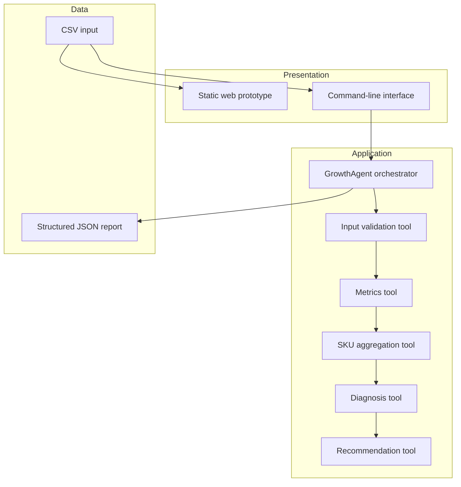
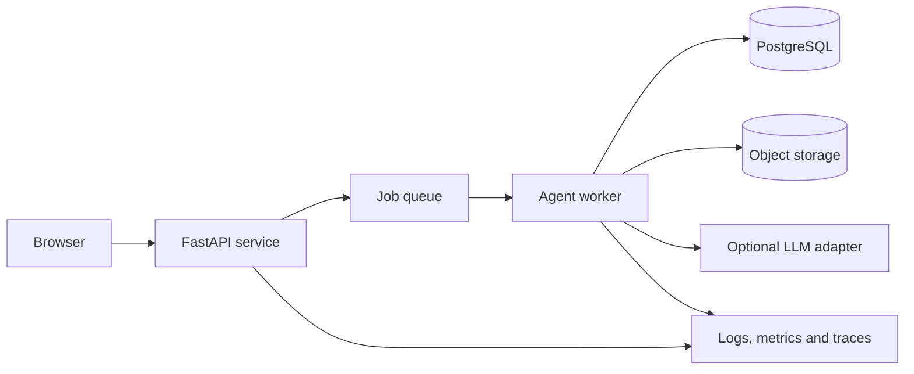

# System Architecture

## Design goals

- zero paid runtime dependency for the public MVP;
- explainable calculations and findings;
- separation between analysis and presentation;
- human approval for external actions;
- clear path from prototype to a controlled service.

## Logical architecture

The browser prototype mirrors the Python domain logic for a zero-setup demonstration. The Python package is the reference implementation for validation and testing.

## Component responsibilities

| Component | Responsibility |
| --- | --- |
| `domain.py` | Parse and validate input rows. |
| `tools.py` | Perform calculations, diagnosis and recommendation construction. |
| `agent.py` | Select tools in a controlled sequence and preserve a trace. |
| `cli.py` | Provide a local execution interface and JSON export. |
| `site/` | Demonstrate the product experience without a server. |

## Future service architecture

### Production decisions still required

- tenant and role model;
- deployment location and data residency;
- encrypted object storage;
- retention and deletion policy;
- idempotency for repeated uploads;
- queue, retry and timeout policy;
- model provider, budget and fallback;
- audit logging and incident response.

## Optional LLM boundary

A model may later:

- rewrite structured findings into plain language;
- answer questions using only the calculated report;
- summarize approved actions.

A model must not:

- calculate financial metrics when deterministic code is available;
- invent missing data;
- execute campaign, pricing or procurement actions without approval;
- receive secrets or personal information in prompts.
