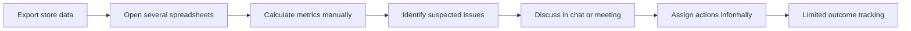
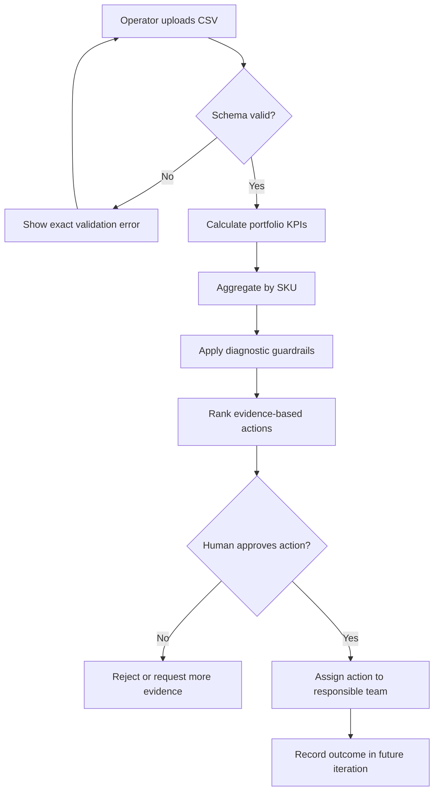

# Business Workflow

## Current-state hypothesis

Observed problems must be validated with real users before a pilot. Likely issues include duplicated calculation, inconsistent thresholds, missing ownership and weak traceability.

## Proposed workflow

## Responsibility swimlane

| Stage | Operator | Growth Agent | Business owner | Functional team |
| --- | --- | --- | --- | --- |
| Prepare data | Responsible | — | — | Consulted |
| Validate and calculate | Informed | Responsible | — | — |
| Review evidence | Responsible | Provides evidence | Accountable | Consulted |
| Approve high-impact action | Consulted | No authority | Accountable | Informed |
| Execute action | Informed | No authority | Accountable | Responsible |
| Review outcome | Responsible | Future analysis | Accountable | Consulted |

## Why a workflow before an autonomous agent

The sequence is predictable and business actions can affect money and inventory. A controlled workflow is safer than allowing a model to choose and execute actions autonomously. The “agent” in this MVP orchestrates analysis tools and prioritizes findings, while authority remains with a human.
